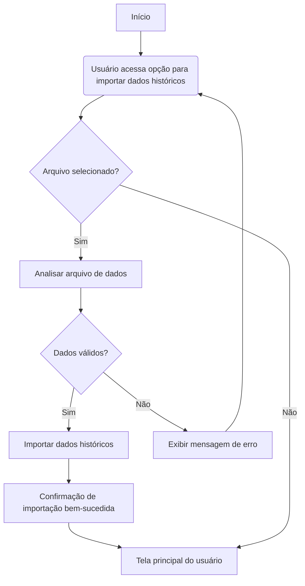

```mermaid
flowchart TD
    A[Início] --> B(Usuário acessa opção para importar dados históricos)
    B --> C{Arquivo selecionado?}
    C -->|Sim| D[Analisar arquivo de dados]
    D --> E{Dados válidos?}
    E -->|Sim| F[Importar dados históricos]
    F --> G[Confirmação de importação bem-sucedida]
    G --> H[Tela principal do usuário]
    E -->|Não| I[Exibir mensagem de erro]
    I --> B
    C -->|Não| H

```