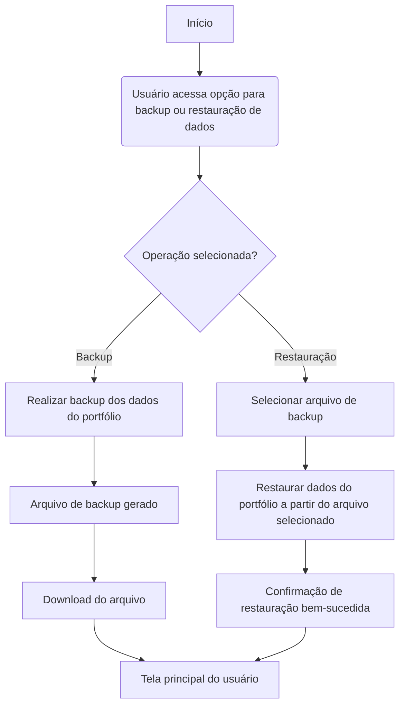

```mermaid
flowchart TD
    A[Início] --> B(Usuário acessa opção para backup ou restauração de dados)
    B --> C{Operação selecionada?}
    C -->|Backup| D[Realizar backup dos dados do portfólio]
    D --> E[Arquivo de backup gerado]
    E --> F[Download do arquivo]
    F --> G[Tela principal do usuário]
    C -->|Restauração| H[Selecionar arquivo de backup]
    H --> I[Restaurar dados do portfólio a partir do arquivo selecionado]
    I --> J[Confirmação de restauração bem-sucedida]
    J --> G
```