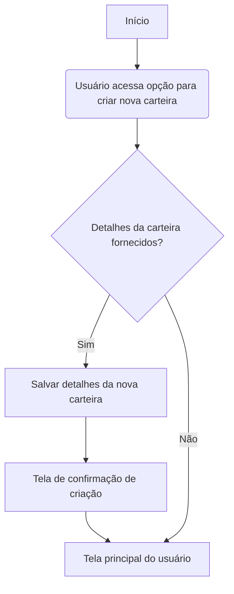

```mermaid
flowchart TD
    A[Início] --> B(Usuário acessa opção para criar nova carteira)
    B --> C{Detalhes da carteira fornecidos?}
    C -->|Sim| D[Salvar detalhes da nova carteira]
    D --> E[Tela de confirmação de criação]
    E --> F[Tela principal do usuário]
    C -->|Não| F

```