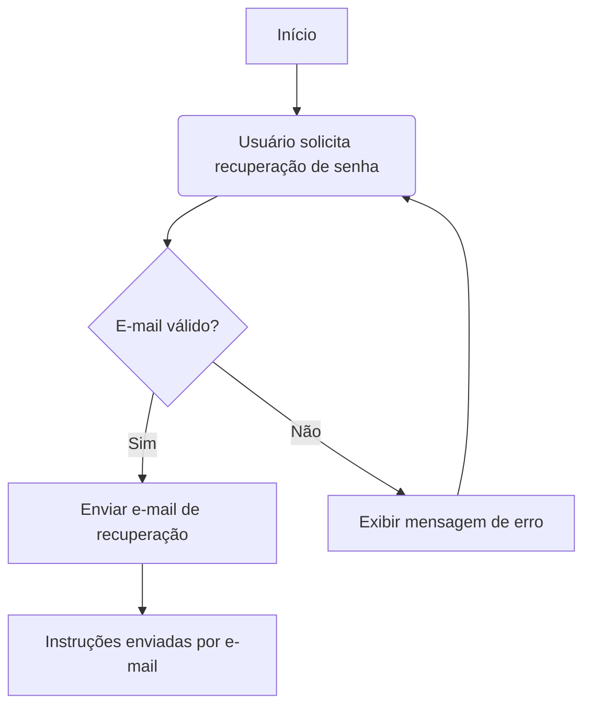

```mermaid
flowchart TD
    A[Início] --> B(Usuário solicita recuperação de senha)
    B --> C{E-mail válido?}
    C -->|Sim| D[Enviar e-mail de recuperação]
    D --> E[Instruções enviadas por e-mail]
    C -->|Não| F[Exibir mensagem de erro]
    F --> B
```
