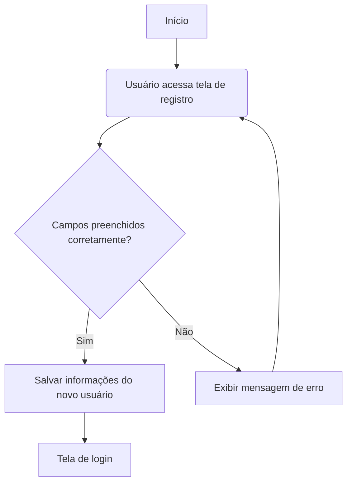

```mermaid
flowchart TD
    A[Início] --> B(Usuário acessa tela de registro)
    B --> C{Campos preenchidos corretamente?}
    C -->|Sim| D[Salvar informações do novo usuário]
    D --> E[Tela de login]
    C -->|Não| F[Exibir mensagem de erro]
    F --> B
```
