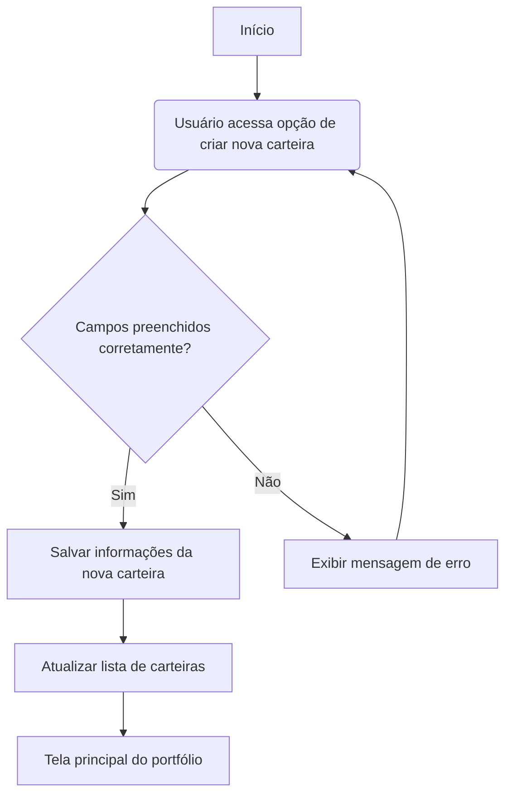

# Login do usuário
___

```mermaid
flowchart TD
    A[Início] --> B(Usuário acessa opção de criar nova carteira)
    B --> C{Campos preenchidos corretamente?}
    C -->|Sim| D[Salvar informações da nova carteira]
    D --> E[Atualizar lista de carteiras]
    E --> F[Tela principal do portfólio]
    C -->|Não| G[Exibir mensagem de erro]
    G --> B
```
