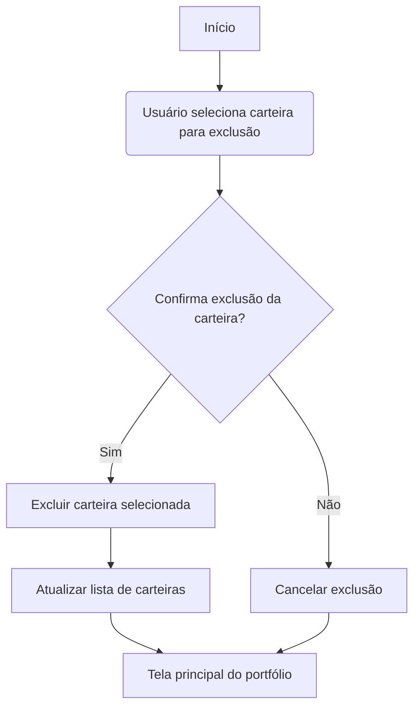

# Login do usuário
___

```mermaid
flowchart TD
    A[Início] --> B(Usuário seleciona carteira para exclusão)
    B --> C{Confirma exclusão da carteira?}
    C -->|Sim| D[Excluir carteira selecionada]
    D --> E[Atualizar lista de carteiras]
    E --> F[Tela principal do portfólio]
    C -->|Não| G[Cancelar exclusão]
    G --> F
```
