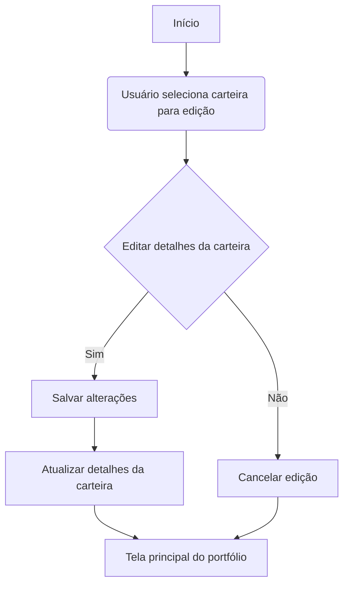

```mermaid
flowchart TD
    A[Início] --> B(Usuário seleciona carteira para edição)
    B --> C{Editar detalhes da carteira}
    C -->|Sim| D[Salvar alterações]
    D --> E[Atualizar detalhes da carteira]
    E --> F[Tela principal do portfólio]
    C -->|Não| G[Cancelar edição]
    G --> F
```
