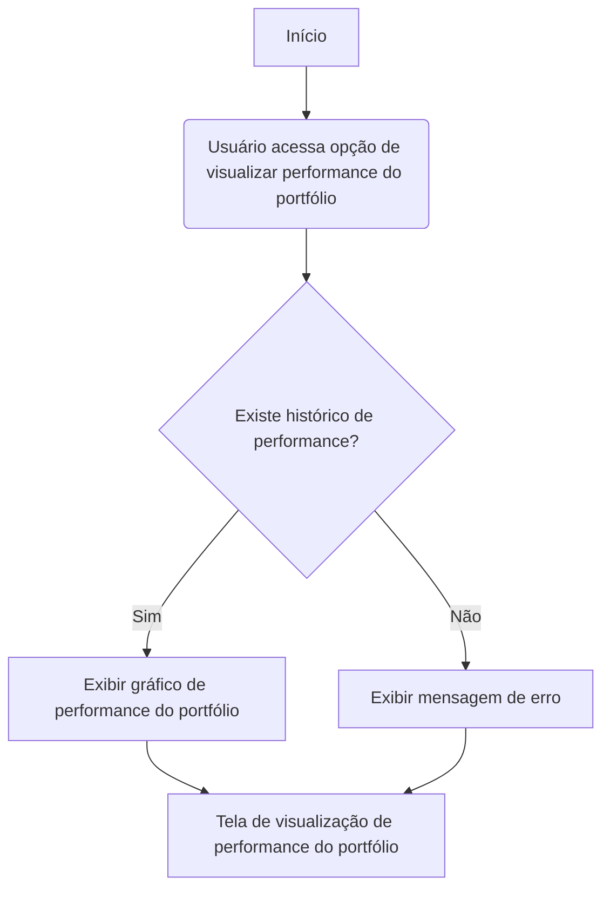

```mermaid
flowchart TD
    A[Início] --> B(Usuário acessa opção de visualizar performance do portfólio)
    B --> C{Existe histórico de performance?}
    C -->|Sim| D[Exibir gráfico de performance do portfólio]
    D --> E[Tela de visualização de performance do portfólio]
    C -->|Não| F[Exibir mensagem de erro]
    F --> E
```
