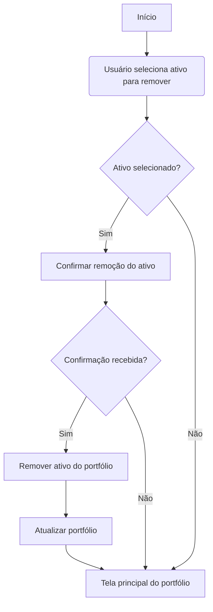

```mermaid
flowchart TD
    A[Início] --> B(Usuário seleciona ativo para remover)
    B --> C{Ativo selecionado?}
    C -->|Sim| D[Confirmar remoção do ativo]
    D --> E{Confirmação recebida?}
    E -->|Sim| F[Remover ativo do portfólio]
    F --> G[Atualizar portfólio]
    G --> H[Tela principal do portfólio]
    E -->|Não| H[Tela principal do portfólio]
    C -->|Não| H[Tela principal do portfólio]
```
