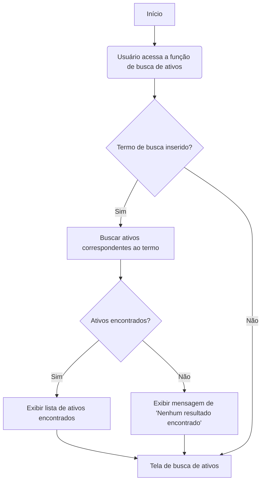

```mermaid
flowchart TD
    A[Início] --> B(Usuário acessa a função de busca de ativos)
    B --> C{Termo de busca inserido?}
    C -->|Sim| D[Buscar ativos correspondentes ao termo]
    D --> E{Ativos encontrados?}
    E -->|Sim| F[Exibir lista de ativos encontrados]
    F --> G[Tela de resultados da busca]
    E -->|Não| H[Exibir mensagem de 'Nenhum resultado encontrado']
    H --> G
    C -->|Não| G[Tela de busca de ativos]
```