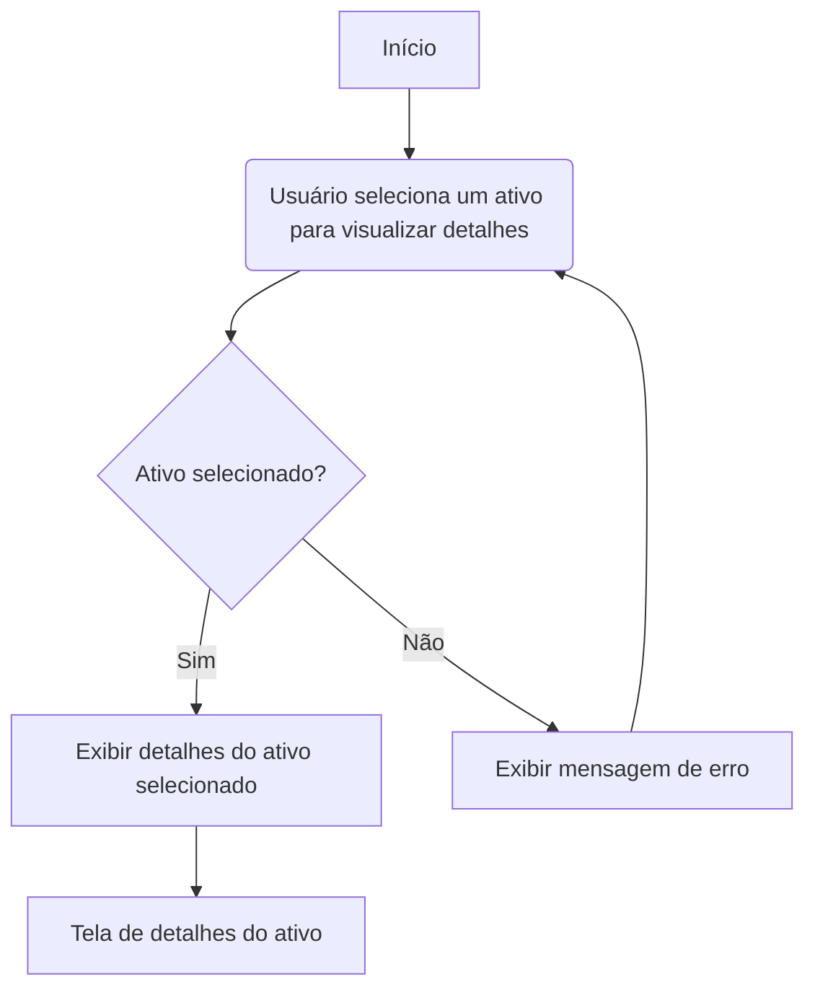

```mermaid
flowchart TD
    A[Início] --> B(Usuário seleciona um ativo para visualizar detalhes)
    B --> C{Ativo selecionado?}
    C -->|Sim| D[Exibir detalhes do ativo selecionado]
    D --> E[Tela de detalhes do ativo]
    C -->|Não| F[Exibir mensagem de erro]
    F --> B
```