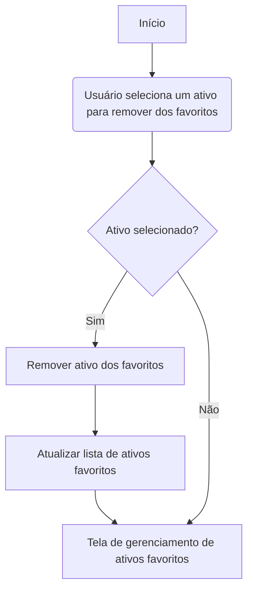

```mermaid
flowchart TD
    A[Início] --> B(Usuário seleciona um ativo para remover dos favoritos)
    B --> C{Ativo selecionado?}
    C -->|Sim| D[Remover ativo dos favoritos]
    D --> E[Atualizar lista de ativos favoritos]
    E --> F[Tela de gerenciamento de ativos favoritos]
    C -->|Não| F[Tela de gerenciamento de ativos favoritos]

```