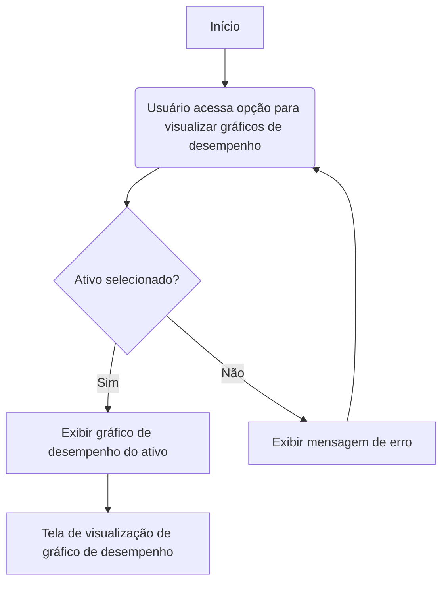

```mermaid
flowchart TD
    A[Início] --> B(Usuário acessa opção para visualizar gráficos de desempenho)
    B --> C{Ativo selecionado?}
    C -->|Sim| D[Exibir gráfico de desempenho do ativo]
    D --> E[Tela de visualização de gráfico de desempenho]
    C -->|Não| F[Exibir mensagem de erro]
    F --> B
```