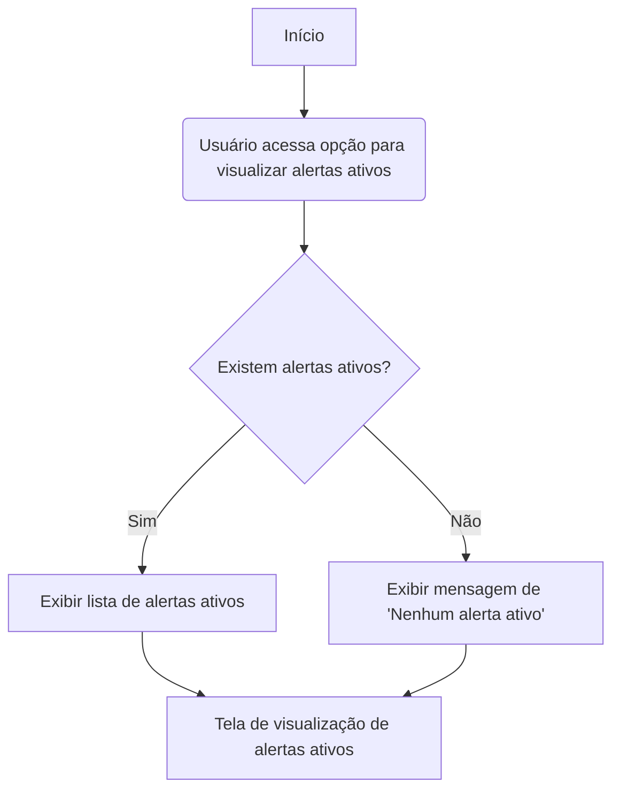

```mermaid
flowchart TD
    A[Início] --> B(Usuário acessa opção para visualizar alertas ativos)
    B --> C{Existem alertas ativos?}
    C -->|Sim| D[Exibir lista de alertas ativos]
    D --> E[Tela de visualização de alertas ativos]
    C -->|Não| F[Exibir mensagem de 'Nenhum alerta ativo']
    F --> E
```