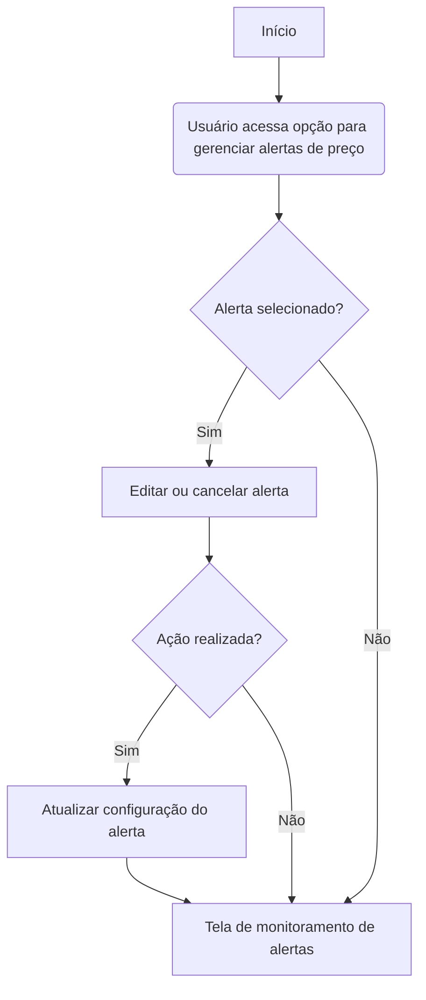

```mermaid
flowchart TD
    A[Início] --> B(Usuário acessa opção para gerenciar alertas de preço)
    B --> C{Alerta selecionado?}
    C -->|Sim| D[Editar ou cancelar alerta]
    D --> E{Ação realizada?}
    E -->|Sim| F[Atualizar configuração do alerta]
    F --> G[Tela de monitoramento de alertas]
    E -->|Não| G[Tela de monitoramento de alertas]
    C -->|Não| G[Tela de monitoramento de alertas]

```