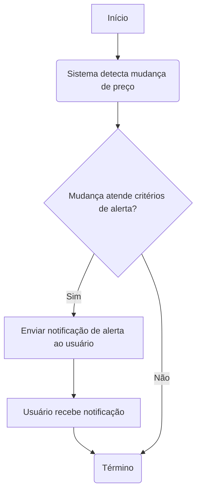

```mermaid
flowchart TD
    A[Início] --> B(Sistema detecta mudança de preço)
    B --> C{Mudança atende critérios de alerta?}
    C -->|Sim| D[Enviar notificação de alerta ao usuário]
    D --> E[Usuário recebe notificação]
    E --> F(Término)
    C -->|Não| F

```