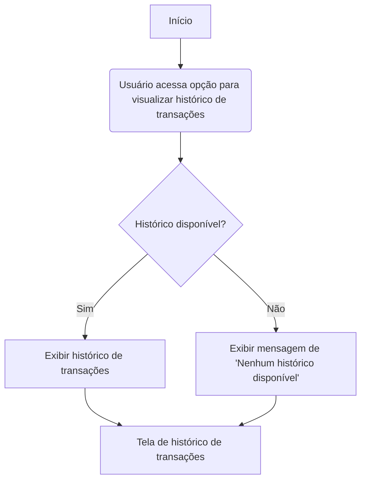

```mermaid
flowchart TD
    A[Início] --> B(Usuário acessa opção para visualizar histórico de transações)
    B --> C{Histórico disponível?}
    C -->|Sim| D[Exibir histórico de transações]
    D --> E[Tela de histórico de transações]
    C -->|Não| F[Exibir mensagem de 'Nenhum histórico disponível']
    F --> E
```