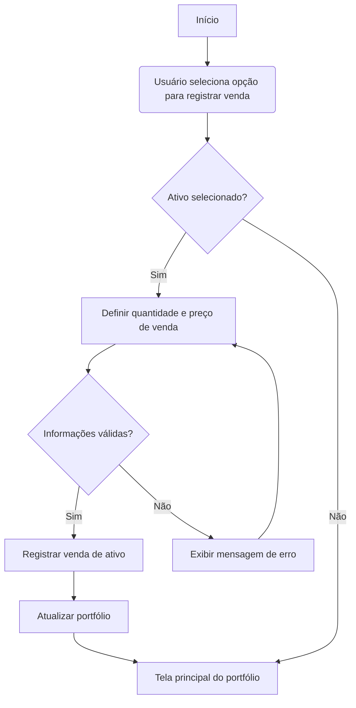

```mermaid
flowchart TD
    A[Início] --> B(Usuário seleciona opção para registrar venda)
    B --> C{Ativo selecionado?}
    C -->|Sim| D[Definir quantidade e preço de venda]
    D --> E{Informações válidas?}
    E -->|Sim| F[Registrar venda de ativo]
    F --> G[Atualizar portfólio]
    G --> H[Tela principal do portfólio]
    E -->|Não| I[Exibir mensagem de erro]
    I --> D
    C -->|Não| H[Tela principal do portfólio]

```