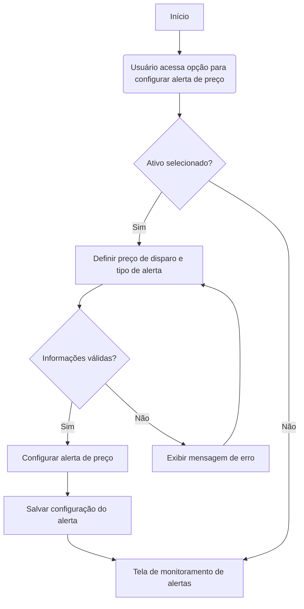

```mermaid
flowchart TD
    A[Início] --> B(Usuário acessa opção para configurar alerta de preço)
    B --> C{Ativo selecionado?}
    C -->|Sim| D[Definir preço de disparo e tipo de alerta]
    D --> E{Informações válidas?}
    E -->|Sim| F[Configurar alerta de preço]
    F --> G[Salvar configuração do alerta]
    G --> H[Tela de monitoramento de alertas]
    E -->|Não| I[Exibir mensagem de erro]
    I --> D
    C -->|Não| H[Tela de monitoramento de alertas]

```