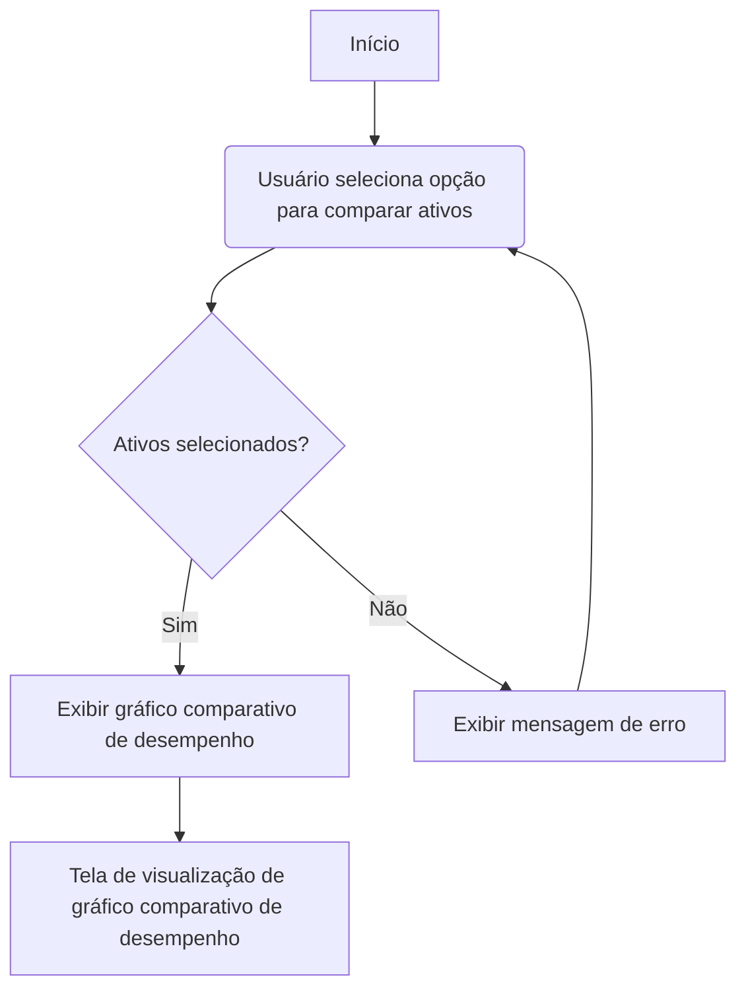

```mermaid
flowchart TD
    A[Início] --> B(Usuário seleciona opção para comparar ativos)
    B --> C{Ativos selecionados?}
    C -->|Sim| D[Exibir gráfico comparativo de desempenho]
    D --> E[Tela de visualização de gráfico comparativo de desempenho]
    C -->|Não| F[Exibir mensagem de erro]
    F --> B
```