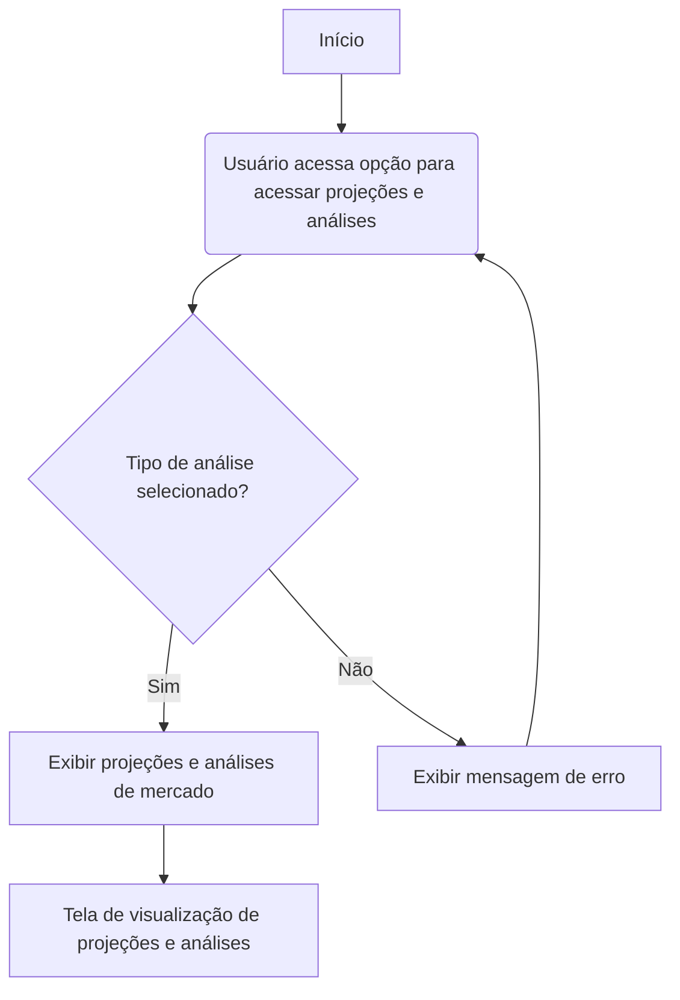

```mermaid
flowchart TD
    A[Início] --> B(Usuário acessa opção para acessar projeções e análises)
    B --> C{Tipo de análise selecionado?}
    C -->|Sim| D[Exibir projeções e análises de mercado]
    D --> E[Tela de visualização de projeções e análises]
    C -->|Não| F[Exibir mensagem de erro]
    F --> B

```