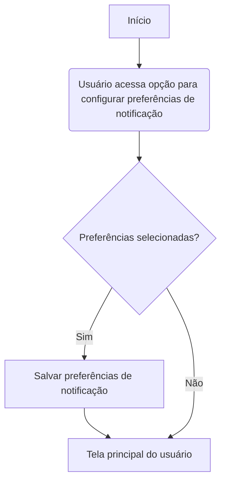

```mermaid
flowchart TD
    A[Início] --> B(Usuário acessa opção para configurar preferências de notificação)
    B --> C{Preferências selecionadas?}
    C -->|Sim| D[Salvar preferências de notificação]
    D --> E[Tela principal do usuário]
    C -->|Não| E[Tela principal do usuário]

```