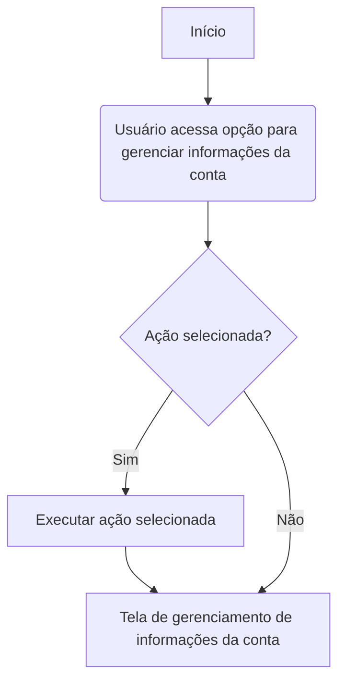

```mermaid
flowchart TD
    A[Início] --> B(Usuário acessa opção para gerenciar informações da conta)
    B --> C{Ação selecionada?}
    C -->|Sim| D[Executar ação selecionada]
    D --> E[Tela de gerenciamento de informações da conta]
    C -->|Não| E[Tela de gerenciamento de informações da conta]

```