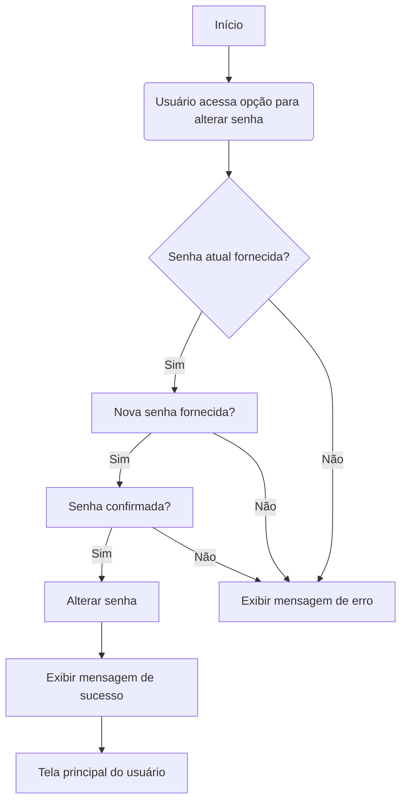

```mermaid
flowchart TD
    A[Início] --> B(Usuário acessa opção para alterar senha)
    B --> C{Senha atual fornecida?}
    C -->|Sim| D[Nova senha fornecida?]
    D -->|Sim| E[Senha confirmada?]
    E -->|Sim| F[Alterar senha]
    F --> G[Exibir mensagem de sucesso]
    G --> H[Tela principal do usuário]
    E -->|Não| I[Exibir mensagem de erro]
    D -->|Não| I
    C -->|Não| I

```