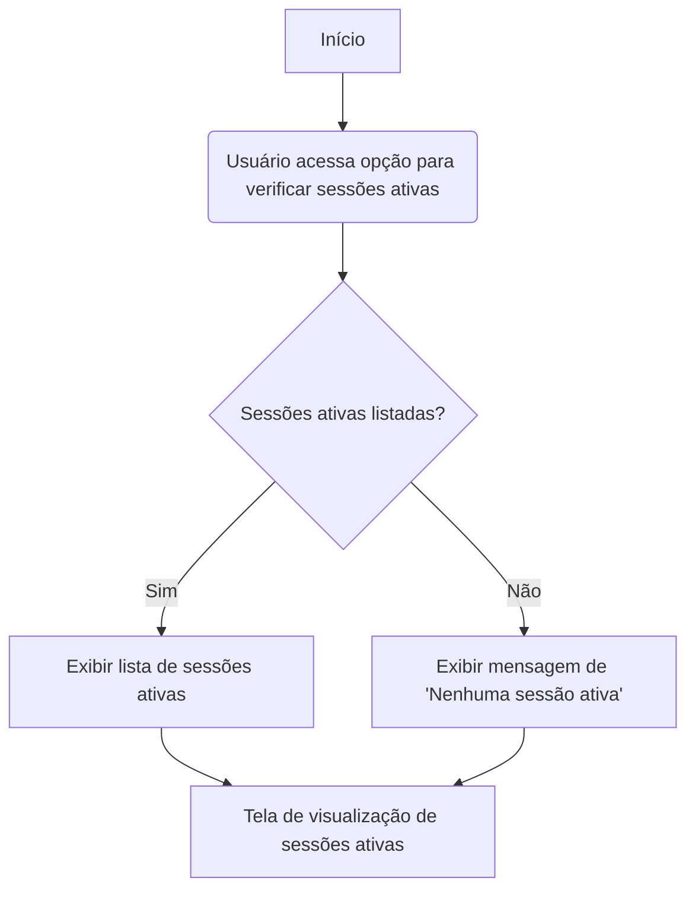

```mermaid
flowchart TD
    A[Início] --> B(Usuário acessa opção para verificar sessões ativas)
    B --> C{Sessões ativas listadas?}
    C -->|Sim| D[Exibir lista de sessões ativas]
    D --> E[Tela de visualização de sessões ativas]
    C -->|Não| F[Exibir mensagem de 'Nenhuma sessão ativa']
    F --> E
```