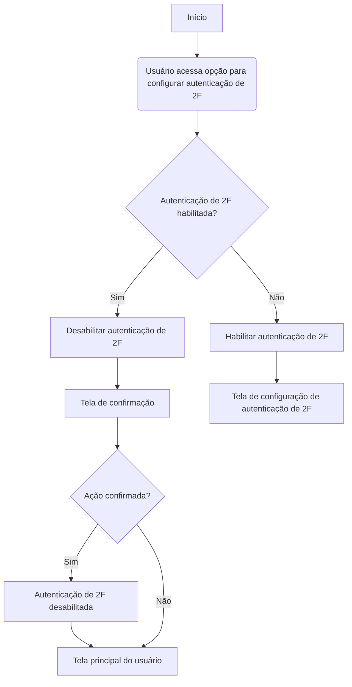

```mermaid
flowchart TD
    A[Início] --> B(Usuário acessa opção para configurar autenticação de 2F)
    B --> C{Autenticação de 2F habilitada?}
    C -->|Sim| D[Desabilitar autenticação de 2F]
    D --> E[Tela de confirmação]
    E --> F{Ação confirmada?}
    F -->|Sim| G[Autenticação de 2F desabilitada]
    G --> H[Tela principal do usuário]
    F -->|Não| H[Tela principal do usuário]
    C -->|Não| I[Habilitar autenticação de 2F]
    I --> J[Tela de configuração de autenticação de 2F]

```