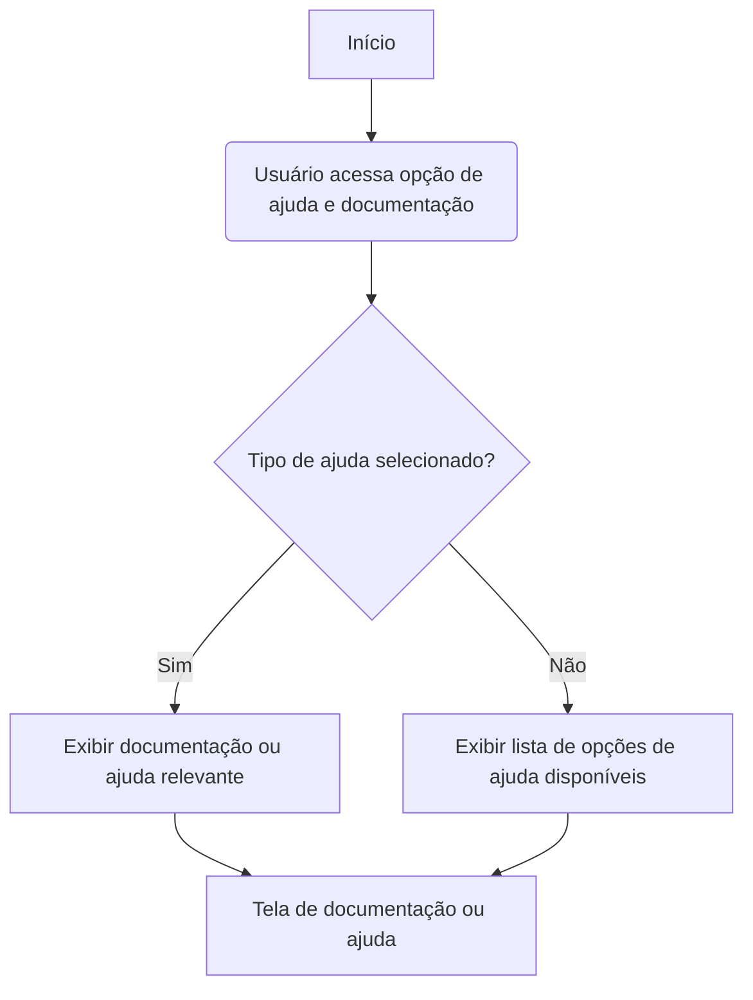

```mermaid
flowchart TD
    A[Início] --> B(Usuário acessa opção de ajuda e documentação)
    B --> C{Tipo de ajuda selecionado?}
    C -->|Sim| D[Exibir documentação ou ajuda relevante]
    D --> E[Tela de documentação ou ajuda]
    C -->|Não| F[Exibir lista de opções de ajuda disponíveis]
    F --> E

```