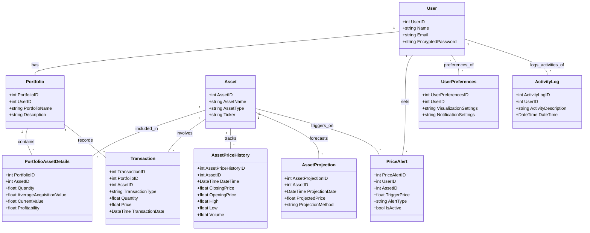

# Modelo conceitual
_____

```mermaid
classDiagram
      class User {
          +int UserID
          +string Name
          +string Email
          +string EncryptedPassword
      }
      class Portfolio {
          +int PortfolioID
          +int UserID
          +string PortfolioName
          +string Description
      }
      class Asset {
          +int AssetID
          +string AssetName
          +string AssetType
          +string Ticker
      }
      class PortfolioAssetDetails {
          +int PortfolioID
          +int AssetID
          +float Quantity
          +float AverageAcquisitionValue
          +float CurrentValue
          +float Profitability
      }
      class Transaction {
          +int TransactionID
          +int PortfolioID
          +int AssetID
          +string TransactionType
          +float Quantity
          +float Price
          +DateTime TransactionDate
      }
      class AssetPriceHistory {
          +int AssetPriceHistoryID
          +int AssetID
          +DateTime DateTime
          +float ClosingPrice
          +float OpeningPrice
          +float High
          +float Low
          +float Volume
      }
      class AssetProjection {
          +int AssetProjectionID
          +int AssetID
          +DateTime ProjectionDate
          +float ProjectedPrice
          +string ProjectionMethod
      }
      class PriceAlert {
          +int PriceAlertID
          +int UserID
          +int AssetID
          +float TriggerPrice
          +string AlertType
          +bool IsActive
      }
      class UserPreferences {
          +int UserPreferencesID
          +int UserID
          +string VisualizationSettings
          +string NotificationSettings
      }
      class ActivityLog {
          +int ActivityLogID
          +int UserID
          +string ActivityDescription
          +DateTime DateTime
      }

      User "1" -- "*" Portfolio : has
      Portfolio "1" -- "*" PortfolioAssetDetails : contains
      Asset "1" -- "*" PortfolioAssetDetails : included_in
      Portfolio "1" -- "*" Transaction : records
      Asset "1" -- "*" Transaction : involves
      Asset "1" -- "*" AssetPriceHistory : tracks
      Asset "1" -- "*" AssetProjection : forecasts
      User "1" -- "*" PriceAlert : sets
      Asset "1" -- "*" PriceAlert : triggers_on
      User "1" -- "*" UserPreferences : preferences_of
      User "1" -- "*" ActivityLog : logs_activities_of
```