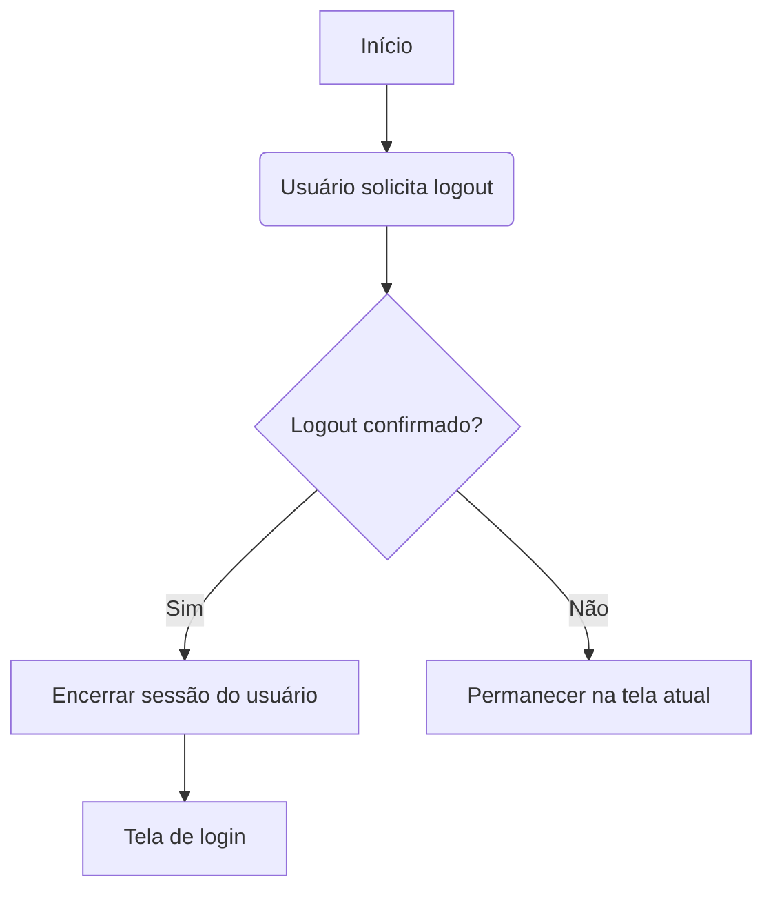

# Login do usuário
___

```mermaid
flowchart TD
    A[Início] --> B(Usuário solicita logout)
    B --> C{Logout confirmado?}
    C -->|Sim| D[Encerrar sessão do usuário]
    D --> E[Tela de login]
    C -->|Não| F[Permanecer na tela atual]
```
